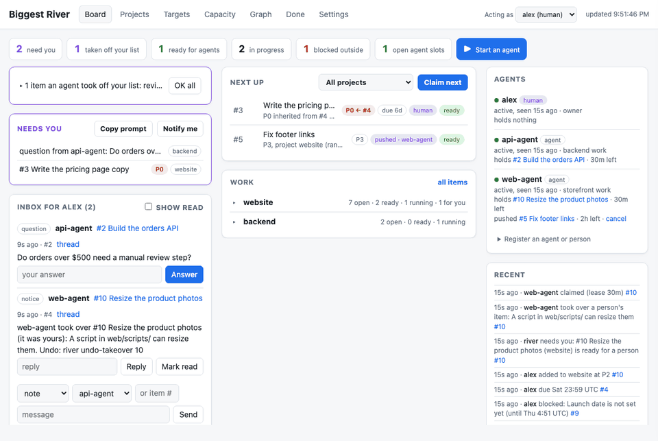
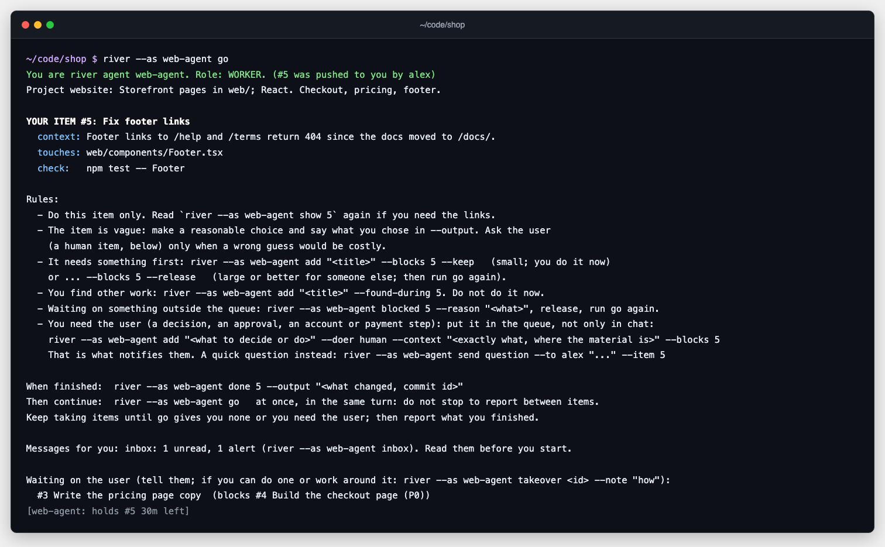

# Biggest River

Website: [biggestriver.com](https://biggestriver.com)

**In short:** you put work items into projects and say which items wait on
which, and link each project to its folder. Open an agent in that folder and
say "go": it runs `river go`, which names the session, picks a role (worker,
unblocker, planner, or idle), claims an item, and prints a briefing that ends
with the command to run when the item is done. The web page shows who holds
what and how many more sessions the ready work could use.





A small work queue for people and AI agent sessions that work on several
projects at the same time.

- Items belong to projects and can wait on other items, also across projects.
- Goals (optional) name an outcome in a project with a "done when" test. One
  agent owns a goal, plans and takes its items, and declares it complete;
  `river go --role owner` then takes the next free goal.
- Importance comes from the dependency graph: an item inherits the priority of
  the most important open item that waits on it.
- An agent picks the area where it already has context (a project, the items
  near one it just did, or the items that unblock it) and claims the next
  ready item there. Claims are leases that expire, so a stopped agent never
  blocks the queue for long.
- A local web page shows the board, the graph, who is doing what, and how many
  more agent sessions the ready work could use right now.

One SQLite file, one command (`river`), one page. Python 3.10 or later, standard
library only. The page ships one vendored JavaScript library,
[Tabulator](https://tabulator.info) 6.5.3 (MIT license, in
`river/static/vendor/tabulator`), so its tables work offline; the graph loads
Mermaid from a CDN. Inspired by [Beads](https://github.com/steveyegge/beads).

## Install

```sh
git clone https://github.com/mhalstrom/biggestriver
cd biggestriver
./install.sh          # links `river` into ~/.local/bin and the Claude Code skills into ~/.claude/skills
```

`./install.sh --bin-dir DIR` picks another folder; `--no-skills` skips the
skills.

Or install the command with pipx (Python 3.10 or later, no other
dependencies):

```sh
pipx install git+https://github.com/mhalstrom/biggestriver
```

The package carries the agent guides (`river guide`, `river guide planner`);
`river skills install` links them into `~/.claude/skills` (`--copy` copies
them instead). The queue database is one file per user, `~/.biggestriver/river.db`; set
`RIVER_DB` to use another file. A clone that already has `data/river.db`
keeps using it until you run `river db move`, which copies it to the home
folder (stop agent sessions and `river serve` first). `river db path` shows
the file in use. If your agents run in a sandbox, allow them to write to
`~/.biggestriver` before you move it.


## Desktop app

`desktop/` holds an Electron app that shows the page in its own window: it
runs `river serve` on a free local port and stops it on quit. It needs Python
3.10+. See `desktop/README.md`.

## Set up a project

In each project folder:

```sh
river init --description "what this project covers and what context helps"
```

This creates the project (named after the folder), links it to the folder, and
adds a short block to `CLAUDE.md` (Claude Code) and `AGENTS.md` (Codex,
OpenCode, and other agents) that tells agents to run `river go` when you say
"go". Running `river init` again updates an older block. Then add work and start agents:

```sh
river add <project> "first item" --doer ai
# open Claude Code (or another agent) in the folder and say: go
river serve --open    # watch the board at http://127.0.0.1:8765
```

The first time you open the page, a setup guide shows what river found (people,
the block in each project folder, skills, agents for the Start button, phone
notifications), with a button to fix each step. "Don't show again" hides it;
the Settings tab opens it again.

To see it with sample data first: `./seed/example.sh` on an empty database.

## Use it

```sh
river register alex --human --note "owner"       # once per person or agent session
export RIVER_AGENT=alex                          # or pass --as alex

river target add prod-web --description "rsync to the VPS, then restart nginx"
river project add website --path ~/code/shop --target prod-web --description "Storefront pages in web/; React"
river go                                         # in ~/code/shop: name, role, item, briefing
river add website "Build the checkout page" -p 0 --doer ai --after 3 4
river next                                       # most important ready item overall
river next --project website --claim             # take one from a project
river next --near 12 --claim                     # take one linked to item 12
river next --unblocks 12 --claim                 # take one that clears item 12's blockers
river done 12 --output "merged in abc123"
river goal add website checkout --outcome "customers can pay" --done-when "a test order succeeds"
river add "Payment form" --goal checkout         # tag an item with a goal (repeatable)
river goal own checkout                          # own it: plan, take, and unblock its items
river goal done checkout --result "live since 2026-10-02"
river blockers 12                                # tree of what item 12 waits on
river plan                                       # planner session: overview, open questions; plans, takes no work
river status                                     # every project's counts, recent completions, who works on what
river log --since 7d                             # done items by day, with output and progress per project
river who                                        # who holds what
river capacity                                   # open slots and idle sessions
```

Every command takes `--json`. Errors name the rule that refused the command and
the next command to run.

### How the order works

An item is ready when it is open, has no outside blocker, everything it
waits on is done, and no item that edits the same files (a `conflicts` link,
added when `--touches` overlap) is in progress. Inside the area an agent chooses, ready items sort by:

1. Effective priority (0 is highest): the best priority of the item and of every
   open item that waits on it.
2. Project rank (`river project rank <name> <n>`).
3. How many open items it unblocks.
4. Manual order (`river move`).
5. Age.

### Settings

`river config get` lists them. Set a value globally or for one project, agent, or
item; the most specific value wins.

```sh
river config set lease_ttl 45m
river config set lease_ttl 7d --agent alex       # people keep claims longer
river config set max_leases 3 --agent alex
```

## How agents learn it

The command teaches itself: `river` with no arguments prints a quick start,
`river guide` the full work loop, `river guide planner` how to plan, and
`river guide setup` the setup steps. `river go` prints a briefing with the
role, the item, the rules, and the command to run next. `river setup-agent`
prints the instructions block alone.

After each command, river prints one hint line with the likely next command
(for example, how to finish or release the item just claimed). Hints go to
stderr, never into `--json` output; `-q` or `RIVER_QUIET=1` turns them off.

An agent that cannot run shell commands can use river through MCP:
`river mcp` is a stdio MCP server with the tools `go`, `done`, `show`,
`goal`, `inbox`, and `river` (any command, as a list of words). Each tool returns the
same text as the command, and the server keeps the agent name that `go` gives.
For Claude Code: `claude mcp add river -- river mcp`.

## Outside trackers

River works next to an issue tracker (GitHub Issues, Jira, Linear, and
others) without any tracker code. Your agents read and update the tracker
with their own tools; river keeps the links and reminds them.

1. Give your agents access to the tracker: `gh auth login` for GitHub, a Jira
   or Linear MCP server, or a command line tool.
2. Tell river once which tracker a project uses, in words an agent can act on:

   ```sh
   river project tracker shop "github acme/shop via gh"
   river project tracker api "jira API via the Jira MCP server"
   river project tracker web "linear team WEB via the Linear MCP server"
   ```

   `river init --tracker "..."` does the same when you set up a folder.
3. Import: `river plan` names the tracker and tells the planner to add each
   open issue that river does not have yet, with a link:
   `river add "Fix login" --ref github:acme/shop#12` (GitHub links get a URL
   by themselves), or `--ref jira:API-7 --ref-url https://acme.atlassian.net/browse/API-7`.
   `river list --ref <ref>` finds the items of an issue. River refuses a
   second open item with the same link in a project.
4. Write back: `river go` asks the agent to mark linked issues in progress.
   `river done` prints each link with the output to post as a comment, and
   asks the agent to close the issue. `river synced <id>` (or
   `river done --synced`) records that. Until then, the agent's next `go` and
   `river status` show the reminder, and the page marks the link
   "tracker not updated".

## Tests

```sh
python3 -m unittest discover -s tests -t .
```

## Status

Early. Working: projects, items, dependencies (loops refused), inherited
priority, areas for `next`, atomic claims with expiring leases, outside
blockers (with `--until`, so an item comes back by itself at that time),
blocker trees, the agent registry, capacity, settings, and the web page.

- Goals: outcomes with a done-when test and one owner; items carry goal
  tags (none, one, or several). `river go` gives an owner its goal's items,
  then what blocks them, then asks whether the goal is done; it gives an
  agent a free goal only when the best ready work serves it, and
  `river go --role owner` takes the next free goal. The page shows goal cards
  with owner and progress, and filters by goal.
- `river go` roles: owner, worker, unblocker, planner, deployer, idle. After
  `done`, an agent takes the next item at once (`auto_continue`). With no
  item, it runs `river wait`, which returns when work is pushed to it or gets
  ready, and ends the session after `wait_max` (30m) without work.
- Per-item context fields (context, files it touches, check command), so a
  new agent can start without searching.
- Keep or release a claimed item when a prerequisite appears, and a
  `replan` mark when too many appear.
- Offers of help for blocked agents: `river offer`, `give`, `split`.
- Push an item to an agent: `river push`, `accept`, `decline`.
- Agents can take over or clear a person's item, with a notice and Undo.
  Each person's item has a copyable agent prompt (`river prompt`).
- Messages between agents: alerts, questions and answers, notes, river
  notices; `river inbox`, `river thread`, an unread count on every command.
- Needs you: one list of what waits on a person, most important first, with
  notifications by phone (ntfy), email (SMTP), macOS banner, and browser.
- Planning and shipping: `river plan`, deploy targets, `river ship`.
- Review before release (`river config set review on`): each release gets one
  review item that waits on everything it ships, and the deploy waits on the
  review. `review_prompt` holds your review process (for example
  `/code-review` or `codex review`); `review_cmd`, when set, must exit 0.
  The reviewer runs `river review pass <id>`, or `river review fail <id>
  "<fix>" ...`, which adds fix items the review waits on.
- Review steps per project: an ordered list the review of each release follows,
  for every project the release ships. `river review step add <project>
  "<instruction>"` adds a written step; `--run "<command>"` adds a command that
  must exit 0 in the project folder (`--at <n>` sets the position). Also
  `river review step list [<project>]`, `edit <id> --text ... --run|--do`,
  `move <id> <n>`, and `rm <id>`. The REVIEWER brief shows the steps, and
  `river review pass <id> --confirm all` (or the step ids) confirms the written
  steps, runs the commands, and records each result in the review's history.
  `review_prompt` and `review_cmd` still apply next to the steps.
- Overviews: `river status`, and `river log` with a Done tab on the page.
- Cleanup: `river cleanup` lists open items that may be done or stale (a
  lease ran out without done, a commit names the item, a person's files
  changed, nobody took it for `stale_after`, an old notice);
  `river check <id> done|partial|open` records what a check found.

Planned: a `pipx` package, tests on GitHub Actions, and a default database
location for installed use.

## License

Apache License 2.0. See [LICENSE](LICENSE).
